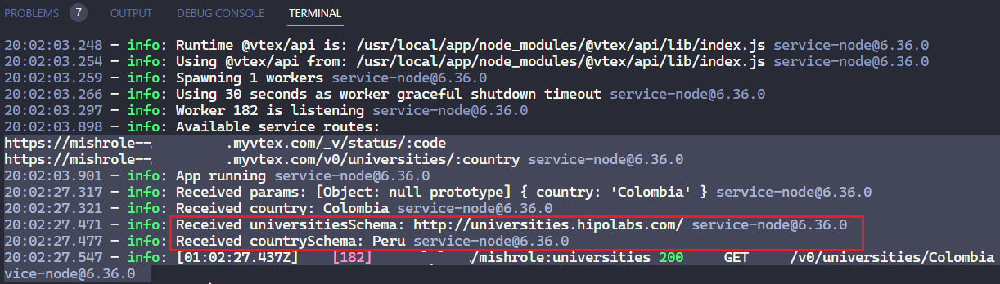
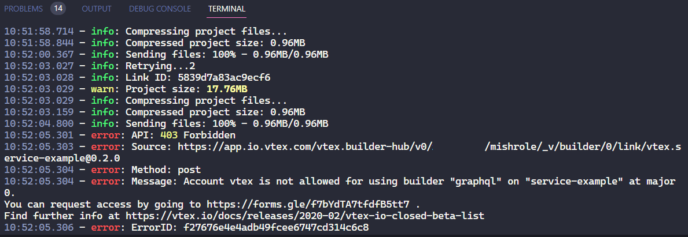

> **Goal** 🚀
> 
> Make a request to an external API and return the response to the client using a VTEX service and middlewares in Node.js

## manifest.json

To make a request to an internal or external API, you need to add a policy with **outbound-access** for external and **inbound-access** for internal requests.

```json
  {
    "name": "outbound-access",
    "attrs": {
      "host": "universities.hipolabs.com",
      "path": "/*"
    }
  },
```

## node/service.json

To create new endpoints, you need to add the name inside **routes** object as a property. The key of this object is an ID to identify the endpoint.

```json
  "universities": {
    "path": "/v0/universities/:country",
    "public": true
  }
```

## node/middlewares/getUniversities.ts

This function is responsible for making the request to the external API by calling the **getUniversitiesByCountry** method (**clients/universities.ts**) and returning a response to the client.

```typescript
  export async function getUniversities(ctx: Context, next: () => Promise<any>) {
    const {
      vtex: {
        route: { params },
      },
    } = ctx

    console.info('Received params:', params)

    const { country } = params

    console.info('Received country:', country)

    const universitiesResponse = await ctx.clients.universities.getUniversitiesByCountry(
      country
    )

    console.info('Received universitiesResponse:', universitiesResponse)

    if (universitiesResponse.status === 200) {
      ctx.body = universitiesResponse.data
    } else {
      ctx.body = 'No universities found'
    }

    await next()
  }
```

## node/clients/universities.ts

This class will be called by the **getUniversities** *middleware* when we make a request to the endpoint **/universities**. The external API url is set in the super constructor and we define the method **getUniversitiesByCountry** to get the list of universities by country.

```typescript
  import type { InstanceOptions, IOContext, IOResponse } from '@vtex/api'
  import { ExternalClient } from '@vtex/api'

  export default class Universities extends ExternalClient {
    constructor(context: IOContext, options?: InstanceOptions) {
      super('http://universities.hipolabs.com/', context, options)
    }

    public async getUniversitiesByCountry(
      country: string | string[]
    ): Promise<IOResponse<string>> {
      return this.http.getRaw(`search?country=${country}`)
    }
  }
```

## node/index.ts

In this file, we define the routes with their REST verbs and the middlewares that will be called when we make a request to the endpoint. The name of this route needs to be the same as the name of the ID of the endpoint in the **service.json** file.

```typescript
  import type { ClientsConfig, RecorderState, ServiceContext } from '@vtex/api'
  import { LRUCache, method, Service } from '@vtex/api'

  import { Clients } from './clients'
  import { getUniversities } from './middlewares/getUniversities'
  import { status } from './middlewares/status'
  import { validate } from './middlewares/validate'

  const TIMEOUT_MS = 800

  // Create a LRU memory cache for the Status client.
  // The @vtex/api HttpClient respects Cache-Control headers and uses the provided cache.
  const memoryCache = new LRUCache<string, any>({ max: 5000 })

  metrics.trackCache('status', memoryCache)

  // This is the configuration for clients available in `ctx.clients`.
  const clients: ClientsConfig<Clients> = {
    // We pass our custom implementation of the clients bag, containing the Status client.
    implementation: Clients,
    options: {
      // All IO Clients will be initialized with these options, unless otherwise specified.
      default: {
        retries: 2,
        timeout: TIMEOUT_MS,
      },
      // This key will be merged with the default options and add this cache to our Status client.
      status: {
        memoryCache,
      },
    },
  }

  declare global {
    // We declare a global Context type just to avoid re-writing ServiceContext<Clients, State> in every handler and resolver
    type Context = ServiceContext<Clients, State>

    // The shape of our State object found in `ctx.state`. This is used as state bag to communicate between middlewares.
    interface State extends RecorderState {
      code: number
    }
  }

  // Export a service that defines route handlers and client options.
  export default new Service({
    clients,
    routes: {
      // `status` is the route ID from service.json. It maps to an array of middlewares (or a single handler).
      status: method({
        GET: [validate, status],
      }),

      universities: method({
        GET: [getUniversities],
      }),
    },
  })
```

<br />

---
<br />

> Goal 🚀
>
> Get access to environment variables and use them in the service.

## manifest.json

Add settingsSchema to **manifest.json** to access the configuration programmatically and use environment variables.

```json
 "settingsSchema": {
    "title": "Test",
    "type": "object",
    "properties": {
      "universities": {
        "title": "Universities",
        "description": "Universities service endpoint",
        "type": "string"
      },
      "country": {
        "title": "Country",
        "description": "Country name",
        "type": "string"
      }
    }
  },
```

Set the variables on the Settings section of the service in the VTEX Admin. Search for the service in the search bar using the title defined in **manifest.json**.

```bash
  vtex browse admin
```


And access the variables whenever you need them. For example, in the **getUniversities** *middleware*.

```typescript
  const APP_ID = process.env.VTEX_APP_ID ? process.env.VTEX_APP_ID : ''
  const {
    universities: universitiesSchema,
    country: countrySchema,
  } = await ctx.clients.apps.getAppSettings(APP_ID)

  console.info('Received universitiesSchema:', universitiesSchema)
  console.info('Received countrySchema:', countrySchema)
```


<br />

---
<br />

> Goal 🚀
>
> Use graphql and make a request to an external API.

## manifest.json

Add the graphql builder.

```json
  "builders": {
    "node": "6.x",
    "docs": "0.x",
    "graphql": "1.x"
  },
```

Each builder has its own folder, Create a **graphql** folder in the root of the project and add a **schema.graphql** file. Define the schema for the query and the type of the response.

```graphql
  type University {
    name: String
    domains: [String]
    state_province: String
    web_pages: [String]
    country: String
    alpha_two_code: String
  }

  type Query {
    getUniversitiesQuery(country: String!): [University]
  }
```

## node/resolvers/universities.ts

Create a **resolvers** folder in the **node** folder and add a **universities.ts** file. This file will contain the resolver for the query defined in the **schema.graphql** file. It has an Args interface with a country string used as our Country Path param, and the University interface used to map the API response.

The property state_province is not in the API, we have state-province instead, so we need to map it and delete the property state-province before returning the response.

```typescript
  interface Args {
    country: string
  }

  interface University {
    name: string
    country: string
    domains: [string]
    state_province: string | undefined
    web_pages: [string]
    alpha_two_code: string
    'state-province'?: string
  }

  export const getUniversitiesQuery = async (
    _: unknown,
    { country }: Args,
    // ctx: Context
    { clients }: Context
  ) => {
    const {
      data: universities,
    } = await clients.universities.getUniversitiesByCountry(country)

    return universities.map((university: University) => {
      university.state_province = university['state-province']
      delete university['state-province']

      return university
    })
  }
```

## node/index.ts

Add the graphql resolver to the **index.ts** file with the **getUniversitiesQuery** query. Also, remove the previous Status route and its State interface definition in the global context, since we will not use it anymore.

```typescript
  declare global {
    // We declare a global Context type just to avoid re-writing ServiceContext<Clients, State> in every handler and resolver
    // type Context = ServiceContext<Clients, State>
    type Context = ServiceContext<Clients>

    // The shape of our State object found in `ctx.state`. This is used as state bag to communicate between middlewares.
    // interface State extends RecorderState {
    //   code: number
    // }
  }

  // Export a service that defines route handlers and client options.
  export default new Service({
    clients,
    routes: {
      // `status` is the route ID from service.json. It maps to an array of middlewares (or a single handler).
      // status: method({
      //   GET: [validate, status],
      // }),

      universities: method({
        GET: [getUniversities],
      }),
    },
    /*
      Schema -> Vtex Services -> Resolves -> Clients -> External Services  
    */
    graphql: {
      resolvers: {
        Query: {
          getUniversitiesQuery,
        },
      },
    },
  })
```

## node/clients/universities.ts

We need to change the response type of the **getUniversitiesByCountry** method to match the response type of the **getUniversitiesQuery** resolver. We use any to avoid changing the response type of the **getUniversitiesByCountry** method, since it is used in the **getUniversities** middleware.

```typescript
  import type { InstanceOptions, IOContext, IOResponse } from '@vtex/api'
  import { ExternalClient } from '@vtex/api'

  export default class Universities extends ExternalClient {
    constructor(context: IOContext, options?: InstanceOptions) {
      super('http://universities.hipolabs.com/', context, options)
    }

    public async getUniversitiesByCountry(
      country: string | string[]
    ): Promise<IOResponse<any>> {
      return this.http.getRaw(`search?country=${country}`)
    }
  }
```

Now we can access the query from the GraphQL IDE in the VTEX Admin and pass the Country as a Query variable. This is an example, we need to use the **getUniversitiesQuery** instead.

```graphql
  query getUniversitiesQuery($country: String!) {
    getUniversitiesQuery(country: $country) {
      name
      country
      domains
      state_province
      web_pages
      alpha_two_code
    }
  }
```


Note that we need to request access to VTEX to be able to use GraphQL in our service. Due to access restrictions, we can't use GraphQL in our service and this code wasn't tested.


